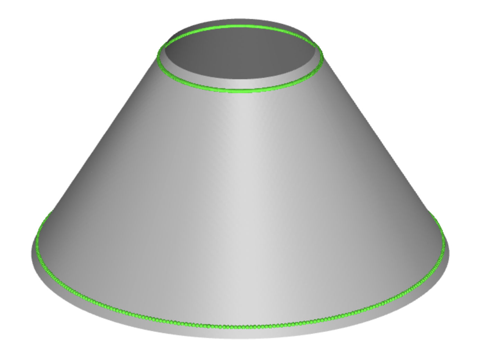
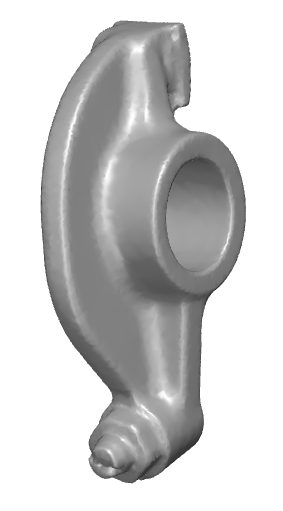
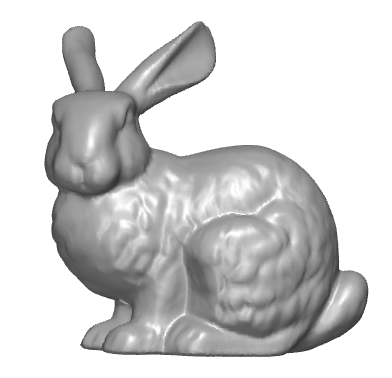
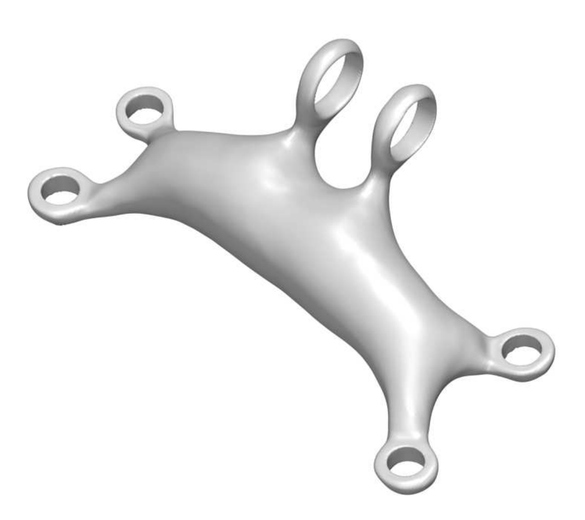

# Gauss-Newton Natural Gradient Descent for Shape Learning

This repository implements [Gauss-Newton Natural Gradient Descent](
https://doi.org/10.48550/arXiv.2602.00099) for training **Implicit Neural Shapes** using geometric constraints. The method extends the [GINN framework](https://arturs-berzins.github.io/GINN/) and is evaluated across multiple key geometry-informed learning tasks: learning minimal surfaces (Plateau's Problem), learning developable surfaces, training implicit neural surfaces (INSs) using ground truth surface data and normals, and training a geometry-informed neural network (GINN) to learn the shape of a jet engine bracket.

## Key Features
- Solves PDE-constrained shape problems without any training data
- Implements constraint-driven learning with INSs
- Features Gauss-Newton optimization alongside traditional methods
- Generates interactive visualizations of results

## Organization

```
/
├── notebooks                       # Jupyter notebooks for experiments 
│   ├── catenoid.ipynb              # Plateu's Problem for Catenoid
│   └── enneper.ipynb               # Plateau's Problem for Enneper Surface
│   ├── cone.ipynb                  # Cone as Developable Surface
│   ├── rockerarm.ipynb             # Rockerarm Implicit Neural Shape
│   ├── bunny.ipynb                 # Stanford Bunny Implicit Neural Shape
│   └── jeb.ipynb                   # Jet engine bracket GINN
├── training/                       # Core training functionality
│   ├── residuals.py                # Loss Residuals
│   ├── optimizers.py               # Custom Gauss-Newton optimizer
│   └── gram_factory.py             # Gram matrix computation for GN
├── GINN/                           # Code from GINN for sampling and PH
│   ├── ph/                         # Classes to manage the connectedness loss based on persistent homology
│   ├── speed/                      # Classes useful for multiprocessing or measuring time
├── models/                         # Model definition
│   └── model_architecture.py       # Neural network architecture
├── util/                           # Utilities used throughout the project
│   ├── surface_sampling.py         # Surface sampling methods
│   └── error_metrics.py            # Evaluation metrics

```

## Get started

Install the dependencies, ideally in a fresh environment

```pip install -r requirements.txt```

Run the example notebooks

```jupyter notebook notebooks/catenoid.ipynb``` or
```jupyter notebook notebooks/enneper.ipynb``` or
```jupyter notebook notebooks/cone.ipynb``` or
```jupyter notebook notebooks/rockerarm.ipynb``` or
```jupyter notebook notebooks/bunny.ipynb``` or
```jupyter notebook notebooks/jeb.ipynb```


### Minimal surfaces

Plateau’s problem is to find the surface $S$ with the minimal area given a prescribed boundary $\Gamma$.
A minimal surface is known to have zero mean-curvature $\kappa_H$ everywhere.

With [notebooks/catenoid.ipynb](notebooks/catenoid.ipynb) and [notebooks/enneper.ipynb](notebooks/enneper.ipynb) you can train an model to learn the Catenoid and the Enneper minimal surfaces via a level set representations.

| Catenoid (grey), $\Gamma$ (green):       | Enneper Surface (grey), $\Gamma$ (green): |
|------------------------------------------|------------------------------------------|
|  |  |

Here are some interactive plots of the resulting surfaces using different optimizers. The surface colors indicate the value of $|\kappa_H(x)|$ at that surface point $x$:
- Catenoid: [Adam](https://JamesAndrewKing.github.io/PreconditionGINNs/k3d_plot_heatmap_catenoid_adam.html), [LBFGS](https://JamesAndrewKing.github.io/PreconditionGINNs/k3d_plot_heatmap_catenoid_lbfgs.html), [Gauss-Newton](https://JamesAndrewKing.github.io/PreconditionGINNs/k3d_plot_heatmap_catenoid_gn.html)
- Enneper Surface: [Adam](https://JamesAndrewKing.github.io/PreconditionGINNs/k3d_plot_heatmap_enneper_adam.html), [Gauss-Newton](https://JamesAndrewKing.github.io/PreconditionGINNs/k3d_plot_heatmap_enneper_gn.html)

### Developable surfaces

A Developable surface $S$ given a prescribed boundary $\Gamma$ has zero Gaussian-curvature $\kappa_G$ everywhere.

With [notebooks/cone.ipynb](notebooks/cone.ipynb) you can train an model to learn the Cone via a level set representation.

| Cone (grey), $\Gamma$ (green):       |
|------------------------------------------|
|  |

Here are some interactive plots of the resulting surfaces using different optimizers. The surface colors indicate the value of $|\kappa_G(x)|$ at that surface point $x$:
- [Adam](https://JamesAndrewKing.github.io/PreconditionGINNs/k3d_plot_cone_adam.html), [Gauss-Newton](https://JamesAndrewKing.github.io/PreconditionGINNs/k3d_plot_cone_gn.html)


### Implicit Neural Shapes

Given ground truth surface points and normals of a surface $S$, we can recover a continuous representation of $S$ via the level set of our model.

With [notebooks/rockerarm.ipynb](notebooks/rockerarm.ipynb) and [notebooks/bunny.ipynb](notebooks/bunny.ipynb) you can train an model to learn the Rockerarm and the Stanford Bunny - two popular benchmark problems - via a level set representations.

| Rockerarm (grey) | Stanford Bunny (grey) |
|------------------------------------------|------------------------------------------|
|  |  |

Here are some interactive plots of the resulting surfaces using different optimizers:
- Rockerarm: [Adam](https://JamesAndrewKing.github.io/PreconditionGINNs/k3d_plot_rockerarm_adam.html), [LBFGS](https://JamesAndrewKing.github.io/PreconditionGINNs/k3d_plot_rockerarm_lbfgs.html), [Gauss-Newton](https://JamesAndrewKing.github.io/PreconditionGINNs/k3d_plot_rockerarm_gn.html)
- Stanford Bunny: [Adam](https://JamesAndrewKing.github.io/PreconditionGINNs/k3d_plot_bunny_adam.html), [LBFGS](https://JamesAndrewKing.github.io/PreconditionGINNs/k3d_plot_bunny_lbfgs.html), [Gauss-Newton](https://JamesAndrewKing.github.io/PreconditionGINNs/k3d_plot_bunny_gn.html)


### Jet Engine Bracket

Given a specified design region we can learn a candidate shape for a jet engine bracket purely using constraints, for example curvature-based smoothness losses or topological losses enforcing connectedness. This example was originally explored in [GINN paper](https://arturs-berzins.github.io/GINN/).

With [notebooks/jeb.ipynb](notebooks/jeb.ipynb) you can train a model to design your own jet engine bracket.

| JEB (grey):       |
|------------------------------------------|
|  |

Here are some interactive plots of the resulting surfaces using different optimizers. The surface colors indicate the value of the surface strain at that surface point $x$:
- [Adam](https://JamesAndrewKing.github.io/PreconditionGINNs/k3d_plot_jeb_adam.html), [Gauss-Newton](https://JamesAndrewKing.github.io/PreconditionGINNs/k3d_plot_jeb_gn.html)
