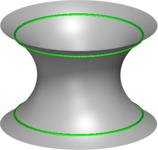
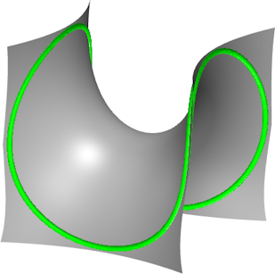

# Preconditioning for Geometry-informed Neural Networks (GINNs)

> **Note**: This repository is currently under active development.

This repository contains the code for my Master's Thesis, where I train Implicit Neural Shapes to solve Plateau's Problem using only constraints. The project extends the [original GINN work](https://arturs-berzins.github.io/GINN/) by implementing [Gauss-Newton Natural Gradient Descent](
https://doi.org/10.48550/arXiv.2402.10680) for minimal surface experiments.

## Key Features
- Solves Plateau's problem (minimal surfaces) without training data
- Implements constraint-based learning with GINNs
- Features Gauss-Newton optimization alongside traditional methods
- Generates interactive visualizations of results

## Organization

```
/
├── notebooks                       # Jupyter notebooks for experiments 
│   ├── catenoid.ipynb              # Plateu's Problem for Catenoid
│   └── enneper.ipynb               # Plateau's Problem for Enneper Surface
├── training/                       # Core training functionality
│   ├── optimizers.py               # Custom Gauss-Newton optimizer
│   └── gram_factory.py             # Gram matrix computation for GN
├── GINN/                           # Code from GINN for sampling and PH
│   ├── ph/                         # Classes to manage the connectedness loss based on persistent homology
│   ├── speed/                      # Classes useful for multiprocessing or measuring time
├── models/                         # Model definition
│   └── model_architecture.py       # Neural network architectures and loss residuals
├── util/                           # Utilities used throughout the project
│   ├── surface_sampling.py         # Surface sampling methods
│   └── error_metrics.py            # Evaluation metrics

```

## Get started

Install the dependencies, ideally in a fresh environment

```pip install -r requirements.txt``` or 
```conda env create -f requirements.yml```

Run the example notebooks

```jupyter notebook notebooks/catenoid.ipynb``` or
```jupyter notebook notebooks/enneper.ipynb```


### Minimal surface

Plateau’s problem is to find the surface $S$ with the minimal area given a prescribed boundary $\Gamma$.
A minimal surface is known to have zero mean-curvature $\kappa_H$ everywhere.

With [notebooks/catenoid.ipynb](notebooks/catenoid.ipynb) and [notebooks/enneper.ipynb](notebooks/enneper.ipynb) you can train a GINN to learn the Catenoid and the Enneper minimal surfaces.

| Catenoid (grey), $\Gamma$ (green):       | Enneper Surface (grey), $\Gamma$ (green): |
|------------------------------------------|------------------------------------------|
|  |  |

Here are some interactive plots of the resulting surfaces using different optimizers. The surface colors indicate the value of $|\kappa_H(x)|$ at that surface point $x$:
- Catenoid: [Adam](https://JamesAndrewKing.github.io/PreconditionGINNs/k3d_plot_heatmap_catenoid_adam.html), [LBFGS](https://JamesAndrewKing.github.io/PreconditionGINNs/k3d_plot_heatmap_catenoid_lbfgs.html), [Gauss-Newton](https://JamesAndrewKing.github.io/PreconditionGINNs/k3d_plot_heatmap_catenoid_gn.html)
- Enneper Surface: [Adam](https://JamesAndrewKing.github.io/PreconditionGINNs/k3d_plot_heatmap_enneper_adam.html), [Gauss-Newton](https://JamesAndrewKing.github.io/PreconditionGINNs/k3d_plot_heatmap_enneper_gn.html)